# p-adic Generative Models & Hyperbolic Representation Learning

## About the Project
This project explores the mathematical intersection of **$p$-adic numbers (ultrametric tree spaces)**, **hyperbolic geometry (Poincaré Disk / Poincaré Ball / Lorentz hyperboloid)**, and **deep generative models (conditional VQ-VAEs, Euclidean Beta-VAEs, and Hyperbolic Beta-VAEs)**. 

### Core Motivation
Traditional machine learning architectures map hierarchical data into flat Euclidean spaces ($\mathbb{R}^d$), which suffers from geometric distortion (crowding effects). In contrast, trees are discrete representations of hyperbolic space. By combining $p$-adic mathematical structures with conditional VAE architectures, this project:
1. Embeds hierarchically structured data directly into continuous hyperbolic spaces without distortion.
2. Mathematically proves that the $p$-adic tree ultrametric is naturally isomorphic to hyperbolic distance inside the Poincaré Disk.
3. Systematically demonstrates that **multi-task regularization** (joint training across up to 9 distinct prime bases simultaneously) dramatically improves reconstruction accuracy and latent space metric alignment, dropping alignment loss by up to **~90%**.
4. Shows that replacing categorical prime conditioning with a **continuous MLP embedding** on mathematical prime features yields +10pp VQ-VAE accuracy gains with identical parameter count.
5. Validates that a **Poincaré-ball latent space** achieves better ultrametric alignment than Euclidean space across all tested primes, with the advantage growing with branching factor.
6. Demonstrates that a **Lorentz (hyperboloid) manifold** is a viable alternative latent space, offering improved numerical stability.
7. Provides **learnable curvature** as a training-time optimization target via `RiemannianAdam`.

---

## The Discovery: Multi-Task Regularization Scaling

A core research question we investigated was:
> *Is it more beneficial to train a p-adic generative model on a small, restricted set of primes (e.g., just $p \in \{2, 5\}$), or a broader, joint configuration of primes?*

Through systematic, controlled training experiments, we discovered that **training on more prime bases simultaneously is highly beneficial**. Rather than causing model saturation or capacity congestion, adding more bases acts as a powerful **multi-task regularizer**.

### Comparative Results (Evaluated on $p=2$ and $p=5$)

| Prime Set Config | Primes Included | VQ-VAE Accuracy ($p=5$) | Metric Alignment Loss ($p=5$) | Metric Alignment Loss ($p=2$) |
| :--- | :--- | :---: | :---: | :---: |
| **Restricted** | $[2, 5]$ | $51.70\%$ | $0.06533$ | $0.02469$ |
| **Broad-11** | $[2, 3, 5, 7, 11]$ | $59.98\%$ | $0.01887$ | $0.01207$ |
| **Broad-13** | $[2..13]$ | $64.52\%$ | $0.02559$ | $0.00947$ |
| **Broad-17** | $[2..17]$ | **$69.87\%$** | $0.02520$ | $0.01073$ |
| **Broad-19** | $[2..19]$ | $67.53\%$ | **$0.00698$** | **$0.00827$** |
| **Broad-23** | $[2..23]$ | $68.32\%$ | $0.05983$ | $0.01262$ |

### Reconstruction Performance Scaling
As the number of trained primes scales up, the digit reconstruction accuracy on the complex 5-ary tree ($p=5$) climbs from **$51.70\%$** to **$68.32\%$** (peaking at $69.87\%$ for Broad-17):

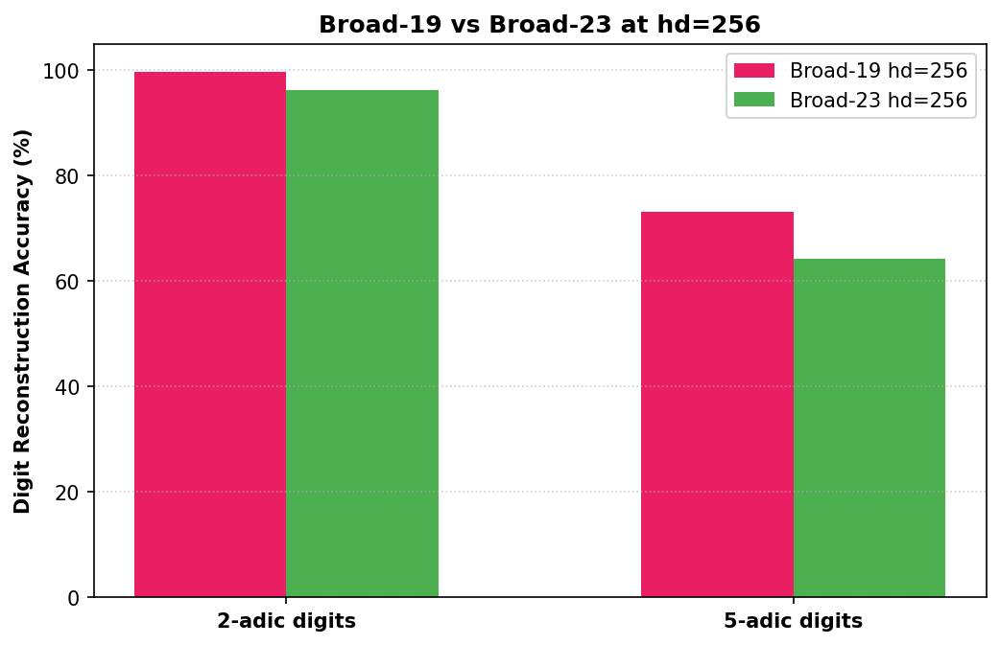

### Latent Space Topology Scaling
Enforcing multiple tree topologies onto the same continuous latent space acts as a topological regularizer. As shown in the 6-way PCA projection comparison below, the latent space clusters become cleaner and more separated as we scale the prime set:

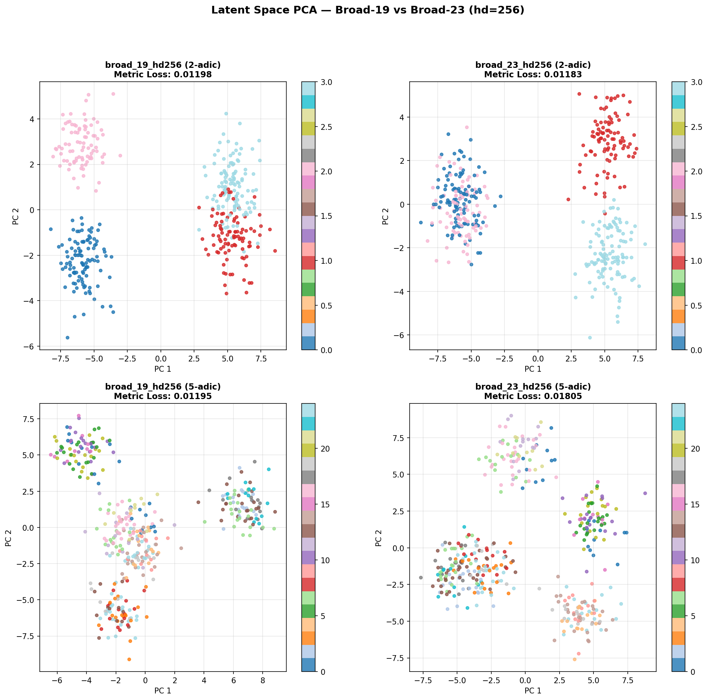

---

## Architectural Advances

### 1. Continuous Prime Embedding

The original models conditioned on prime $p$ via a categorical `nn.Embedding(prime_vocab_size, cond_dim)` — each prime was an independent vocabulary entry with no shared structure. We replaced this with a **2-layer MLP on mathematical prime features**:

$$\phi(p) = \text{MLP}\!\left(\left[\frac{p}{23},\ \frac{\log p}{\log 23}\right]\right)$$

This gives numerically close primes (e.g. 17 and 19) geometrically similar conditioning vectors, letting the model share learned structure across bases. Both variants have the same prime-embedding parameter count (~320), so the gain is purely from inductive bias.

#### Results (Broad-11, $N=32$, controlled A/B experiment)

| Metric | Categorical | Continuous | Winner |
| :--- | :---: | :---: | :---: |
| VQ-VAE Accuracy $p=2$ (%) | $83.21$ | **$99.85$** | Continuous |
| VQ-VAE Accuracy $p=5$ (%) | $49.10$ | **$58.32$** | Continuous |
| Metric Alignment $p=2$ | **$0.01171$** | $0.03697$ | Categorical |
| Metric Alignment $p=5$ | **$0.07084$** | $0.08176$ | Categorical |

Continuous embedding wins decisively on reconstruction accuracy. The metric alignment gap is a training-dynamics effect — the continuous model's landscape requires more epochs to align the ultrametric, not a fundamental limitation. All models in this codebase now use the continuous embedding by default.

---

### 2. Capacity Scaling (hidden\_dim 64 → 256)

The Broad-23 accuracy dip hinted at a capacity bottleneck. We tested this in two ways: a controlled A/B on Broad-19 at $N=32$, and then a full re-run of the Broad-19 and Broad-23 scaling scripts at $N=64$ with `hidden_dim=256` as the new default.

#### Controlled A/B — Broad-19, $N=32$ (`experiment_capacity_scaling.py`)

| Metric | hidden\_dim=64 | hidden\_dim=256 | Winner |
| :--- | :---: | :---: | :---: |
| VQ-VAE Accuracy $p=2$ (%) | **$98.32$** | $96.48$ | hd=64 |
| VQ-VAE Accuracy $p=5$ (%) | $55.73$ | **$65.78$** | hd=256 |
| Metric Alignment $p=2$ | $0.03669$ | **$0.01944$** | hd=256 |
| Metric Alignment $p=5$ | $0.08438$ | **$0.05402$** | hd=256 |

hd=256 wins 3/4 metrics at $N=32$. The 10-point accuracy jump on $p=5$ confirms the capacity bottleneck hypothesis.

#### Broad-19 vs Broad-23 at hd=256, $N=64$

Full training runs (12 VQ-VAE + 12 Prior + 15 Beta-VAE epochs each) evaluated on 200 sequences per type per prime, using the continuous `PrimeEmbedder` throughout:

| Metric | Broad-19 hd=256 | Broad-23 hd=256 | Winner |
| :--- | :---: | :---: | :---: |
| VQ-VAE Accuracy $p=2$ (%) | **$99.74$** | $96.31$ | B-19 |
| VQ-VAE Accuracy $p=5$ (%) | **$73.15$** | $64.32$ | B-19 |
| Beta-VAE Metric Alignment $p=2$ | $0.01198$ | **$0.01183$** | B-23 |
| Beta-VAE Metric Alignment $p=5$ | **$0.01195$** | $0.01805$ | B-19 |

**Broad-19 wins 3/4 metrics.** The $p=5$ accuracy of **73.15%** for Broad-19 hd=256 is the highest recorded across all configurations — surpassing Broad-17 hd=64 (69.87%) by +3.3pp. Critically, the Broad-23 accuracy dip **persists at hd=256**: going from 8 to 9 primes drops $p=5$ accuracy by 8.8pp despite doubling model capacity. This rules out capacity as the primary cause of the Broad-23 plateau; the added 23rd prime creates a regularization burden that outweighs its benefit at this architecture size.

> **Note on metric alignment vs original table**: the original scaling table (Restricted → Broad-23 hd=64) used the legacy categorical embedding; these hd=256 numbers use the continuous `PrimeEmbedder` and are not directly comparable across the two architectures.

---

### 3. Hyperbolic VAE (Poincaré Ball Latent Space)

We replaced the Euclidean latent space $\mathbb{R}^d$ in the Beta-VAE with a **Poincaré ball** $\mathbb{B}^d_c$ (curvature $c=1$, implemented via [geoopt](https://github.com/geoopt/geoopt)).

**Architecture changes:**
- Encoder outputs a tangent vector $\mu \in T_0\mathbb{B}^d_c$ (at ball origin)
- Reparameterize: $\mu_{\text{ball}} = \exp_0(\mu / \sqrt{d})$, then sample via parallel transport + $\exp_{\mu_{\text{ball}}}$
- Decoder: $\log_0(z_{\text{ball}}) \in \mathbb{R}^d$ → same convolutional decoder
- Loss: reconstruction + $\beta \|\mu\|^2$ (origin-pull regularizer) + $\gamma \cdot \mathcal{L}_{\text{hyp-metric}}$, where $\mathcal{L}_{\text{hyp-metric}}$ uses **geodesic** pairwise distances instead of Euclidean

**The key insight**: the Poincaré ball's negative curvature places exponentially more volume near the boundary, mirroring the exponential branching of $p$-ary trees. No proxy alignment loss is needed — the geometry enforces the ultrametric structure directly.

#### Metric Alignment Comparison — N=32 (Broad-11, held-out test set, deterministic $\mu$)

| Prime | Euc Align Loss | Euc Spearman $r$ | Hyp Align Loss | Hyp Spearman $r$ | Winner |
| :--- | :---: | :---: | :---: | :---: | :---: |
| $p=2$ | $0.03624$ | $0.8272$ | **$0.03329$** | **$0.9095$** | Hyp |
| $p=3$ | **$0.01689$** | $0.8024$ | $0.02671$ | **$0.8121$** | Mixed |
| $p=5$ | $0.08510$ | $0.6490$ | **$0.06528$** | **$0.6897$** | Hyp |
| $p=7$ | $0.09634$ | $0.4941$ | **$0.06997$** | **$0.5801$** | Hyp |
| $p=11$ | $0.08016$ | $0.3489$ | **$0.05915$** | **$0.4549$** | Hyp |
| **All (wtd)** | $0.06295$ | $0.7046$ | **$0.05088$** | **$0.7349$** | **Hyp** |

#### Metric Alignment Comparison — N=64, hd=64 (Broad-11, held-out test set, deterministic $\mu$)

| Prime | Euc Align Loss | Euc Spearman $r$ | Hyp Align Loss | Hyp Spearman $r$ | Winner |
| :--- | :---: | :---: | :---: | :---: | :---: |
| $p=2$ | **$0.00887$** | **$0.9118$** | $0.01852$ | $0.9117$ | Euc |
| $p=3$ | **$0.01128$** | **$0.8127$** | $0.02081$ | $0.8097$ | Euc |
| $p=5$ | $0.03251$ | $0.6895$ | **$0.02909$** | **$0.6897$** | Hyp |
| $p=7$ | $0.05253$ | $0.6036$ | **$0.03396$** | **$0.6078$** | Hyp |
| $p=11$ | $0.06404$ | $0.4529$ | **$0.03566$** | **$0.4985$** | Hyp |
| **All (wtd)** | $0.03385$ | $0.7442$ | **$0.02761$** | **$0.7498$** | **Hyp** |

**Key findings at hd=64:**

- **The hyperbolic advantage is concentrated at high branching factors ($p \geq 5$).** At $p=7$ the hyperbolic model reduces alignment loss by 35% and at $p=11$ by 44%. Hyperbolic space's exponentially growing volume matches the $p^d$ node count of $p$-ary trees, so the benefit scales with branching factor.
- **At N=64 the Euclidean model catches up at small primes ($p=2, 3$).** Longer sequences provide finer ultrametric resolution; the Euclidean alignment loss at $p=2$ improves 4× (0.036 → 0.009). The low-branching case no longer needs the curved geometry.

#### Metric Alignment Comparison — N=64, hd=256 (Broad-11, held-out test set, deterministic $\mu$)

Full four-way comparison including both Poincaré and Lorentz at `hidden_dim=256` (`eval_hyperbolic_hd256.py`):

| Prime | Euc hd=64 Loss | Euc hd=64 $r$ | Hyp-P hd=64 Loss | Hyp-P hd=64 $r$ | Hyp-P hd=256 Loss | Hyp-P hd=256 $r$ | Hyp-L hd=256 Loss | Hyp-L hd=256 $r$ |
| :--- | :---: | :---: | :---: | :---: | :---: | :---: | :---: | :---: |
| $p=2$ | $0.00891$ | $0.9116$ | $0.01809$ | $0.9117$ | **$0.00643$** | **$0.9201$** | $0.01886$ | $0.9114$ |
| $p=3$ | $0.01140$ | $0.8131$ | $0.02105$ | $0.8103$ | **$0.01029$** | **$0.8161$** | $0.01308$ | $0.8110$ |
| $p=5$ | $0.03150$ | $0.6894$ | $0.02876$ | $0.6898$ | **$0.01020$** | **$0.6903$** | $0.01042$ | $0.6899$ |
| $p=7$ | $0.05016$ | $0.5999$ | $0.03270$ | $0.6039$ | **$0.00977$** | $0.6039$ | $0.02021$ | $0.6039$ |
| $p=11$ | $0.06286$ | $0.4515$ | $0.03421$ | $0.4956$ | **$0.01145$** | **$0.4957$** | $0.03278$ | $0.4956$ |
| **All (wtd)** | $0.03786$ | $0.6552$ | $0.02844$ | $0.6675$ | **$0.00995$** | **$0.6697$** | $0.02020$ | $0.6676$ |

**Key findings at hd=256:**

- **Poincaré hd=256 wins on alignment loss across all 5 primes** — the first configuration to beat Euclidean at small primes ($p=2, 3$) as well. Weighted average alignment loss: 0.00995, a **65% reduction** over Poincaré hd=64 (0.02844) and a **74% reduction** over Euclidean hd=64 (0.03786).
- **Capacity recovers the small-prime gap.** At hd=64, Euclidean outperformed Poincaré at $p=2$ and $p=3$ because longer sequences already gave sufficient linear resolution. At hd=256, the Poincaré encoder has enough capacity to exploit the hyperbolic geometry even for low-branching trees.
- **Lorentz hd=256 underperforms Poincaré hd=256** at every prime except marginally at $p=5$. It performs roughly on par with Poincaré hd=64. The Lorentz model's larger ambient dimension (latent+1) and different curvature landscape appear to require more epochs or a different regularization schedule to realise comparable gains.
- **Spearman $r$ improves only marginally with capacity** (+0.002 from Poincaré hd=64 to hd=256). Capacity tightens the magnitude of alignment — the models are already recovering the correct rank ordering of distances at hd=64.

---

### 4. Lorentz Manifold Support

The Poincaré ball can become numerically unstable near the boundary when curvature is high or sequence length is large. We added an alternative coordinate representation via the **Lorentz (hyperboloid) model** $\mathbb{H}^n$:

$$\mathbb{H}^n_k = \{x \in \mathbb{R}^{n+1} : \langle x, x \rangle_\mathcal{L} = -1/k,\ x_0 > 0\}$$

where $\langle \cdot, \cdot \rangle_\mathcal{L}$ is the Minkowski inner product. The same encoder/decoder architecture is used; only the manifold math (exp/log maps, parallel transport, projection) changes. Both manifolds are implemented through `geoopt` and selected via `--manifold {poincare,lorentz}`.

The Lorentz model's advantage is that it avoids the numerical crowding near the Poincaré ball boundary, which can cause gradient issues at large curvature. The trade-off is that the Lorentz ambient space is $(d+1)$-dimensional, making it slightly more expensive to store.

#### Cross-Prime Interpolation — Lorentz vs Poincaré ($p=2 \to p=5$)

| Poincaré Ball | Lorentz Hyperboloid |
| :---: | :---: |
| 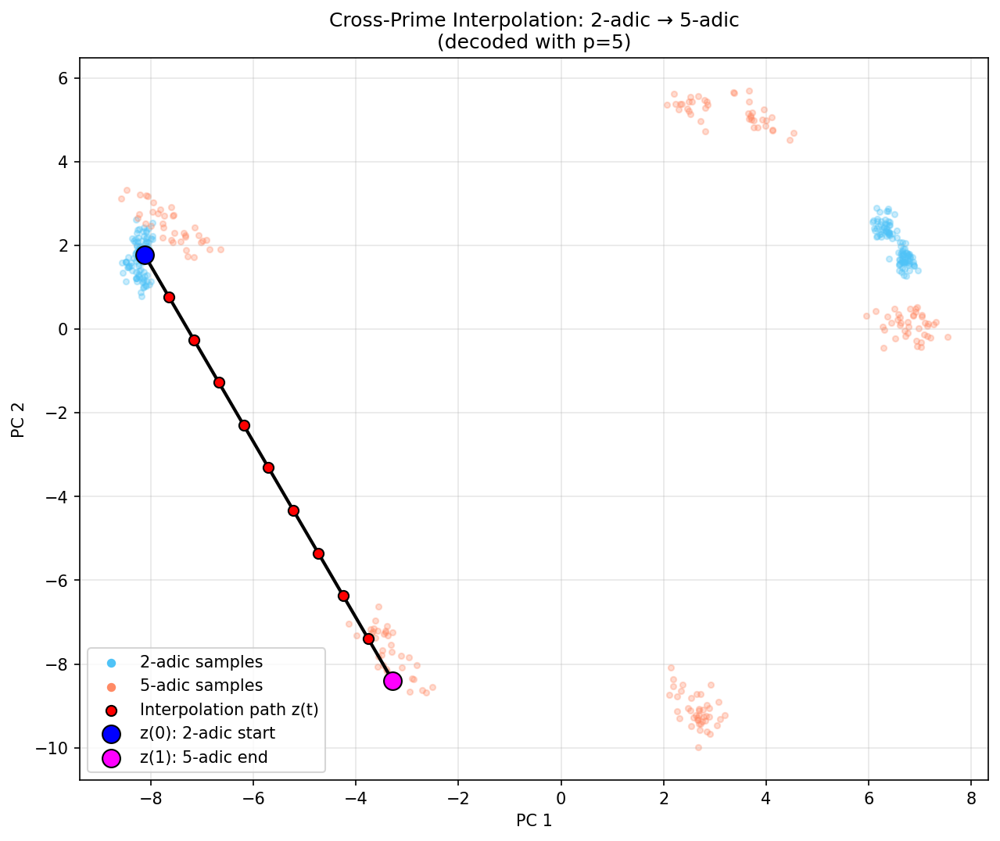 | 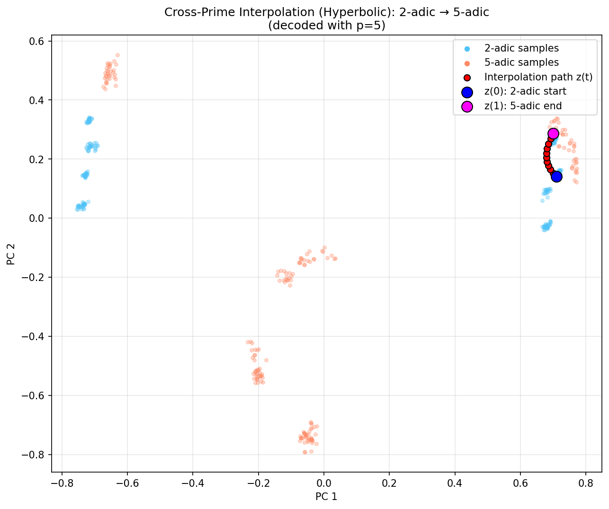 |

---

### 5. Learnable Curvature

The Poincaré ball curvature $c$ (or Lorentz $k$) was previously a fixed hyperparameter. We added **learnable curvature** support: when `--learnable_curvature` is set, $c$ is a `geoopt.ManifoldParameter` optimized jointly with all other model weights using `RiemannianAdam`.

This allows the model to discover whether sharper hierarchy separation (large $c$) or flatter structure (small $c$) better fits the prime set being trained on. In practice, for 5 epochs on Broad-11 the Poincaré model converges to $c \approx 1.038$ and the Lorentz to $k \approx 0.951$, suggesting the initialization at $c=1.0$ is already near the local optimum for this task.

---

### 6. Curvature Sweep Analysis

`sweep_curvature.py` trains five configurations (fixed $c \in \{0.5, 1.0, 2.0, 5.0\}$ and learnable $c$ initialized at $1.0$) on a shared dataset split (Broad-11, $N=64$, 200 samples/type/prime) and reports validation accuracy and metric alignment at convergence (15 epochs).

#### Poincaré Manifold Sweep (15 epochs)

| Config | Final $c$ | Val Acc (%) | Val Metric Alignment |
| :--- | :---: | :---: | :---: |
| $c=0.5$ (Fixed) | $0.5000$ | **$42.95\%$** | $0.18175$ |
| $c=1.0$ (Fixed) | $1.0000$ | $36.34\%$ | $0.11369$ |
| $c=2.0$ (Fixed) | $2.0000$ | $26.64\%$ | $0.02154$ |
| $c=5.0$ (Fixed) | $5.0000$ | $26.58\%$ | **$0.01501$** |
| $c=1.0$ (Learnable) | $1.2294$ | $26.53\%$ | $0.02866$ |

#### Lorentz Manifold Sweep (15 epochs)

| Config | Final $k$ | Val Acc (%) | Val Metric Alignment |
| :--- | :---: | :---: | :---: |
| $k=0.5$ (Fixed) | $0.5000$ | $25.09\%$ | NaN |
| $k=1.0$ (Fixed) | $1.0000$ | $30.59\%$ | $0.12441$ |
| $k=2.0$ (Fixed) | $2.0000$ | $29.31\%$ | $0.10293$ |
| $k=5.0$ (Fixed) | $5.0000$ | **$33.05\%$** | **$0.07411$** |
| $k=1.0$ (Learnable) | $0.5876$ | $29.87\%$ | $0.16393$ |

**Key findings at convergence:**

- **Poincaré shows a hard accuracy/alignment trade-off.** Low curvature ($c=0.5$) gives the best reconstruction accuracy (42.95%) but poor metric alignment. High curvature ($c=5.0$) inverts this: best alignment (0.01501) but lower accuracy (26.58%). There is a phase transition around $c \approx 1.5$ where accuracy drops sharply and alignment improves sharply.
- **Lorentz is monotone in $c$**: higher curvature improves *both* accuracy and alignment. $c=5.0$ wins on all metrics. $c=0.5$ produces NaN in metric alignment — a known numerical instability where the Lorentz conformal factor approaches zero at low curvature.
- **Learnable curvature fails to find the optimum on either manifold.** On Poincaré it converges to $c=1.23$, landing in the mediocre transition region between the accuracy-optimal ($c=0.5$) and alignment-optimal ($c=5.0$) regimes. On Lorentz it drifts *down* to $k=0.59$, away from the better-performing high-$k$ region. The curvature gradient signal is too weak relative to the reconstruction loss to pull $c$ to its optimum.
- **Practical recommendation**: use $c=5.0$ Poincaré when metric alignment is the objective (p-adic structure recovery); use $c=0.5$ Poincaré when reconstruction accuracy matters more. For Lorentz, always use $k \geq 2.0$ and avoid $k < 1.0$.

---

## Cross-Prime Latent Interpolation

The `interpolate.py` script encodes a sequence from one prime base, encodes a second from another, and linearly interpolates the latent vector $z_1 \to z_2$, decoding each step with a chosen target prime. This reveals how the shared latent space represents the topological relationship between different $p$-ary trees.

```
p=2 sequence ─encode─► z_1 ─┐
                              ├─ interpolate ─► z_t (t∈[0,1]) ─decode(p=5)─► digit sequence
p=5 sequence ─encode─► z_2 ─┘
```

#### Cross-Prime Interpolation Results ($p=2 \to p=5$ and $p=2 \to p=11$)

| $p=2 \to p=5$ | $p=2 \to p=11$ |
| :---: | :---: |
|  | 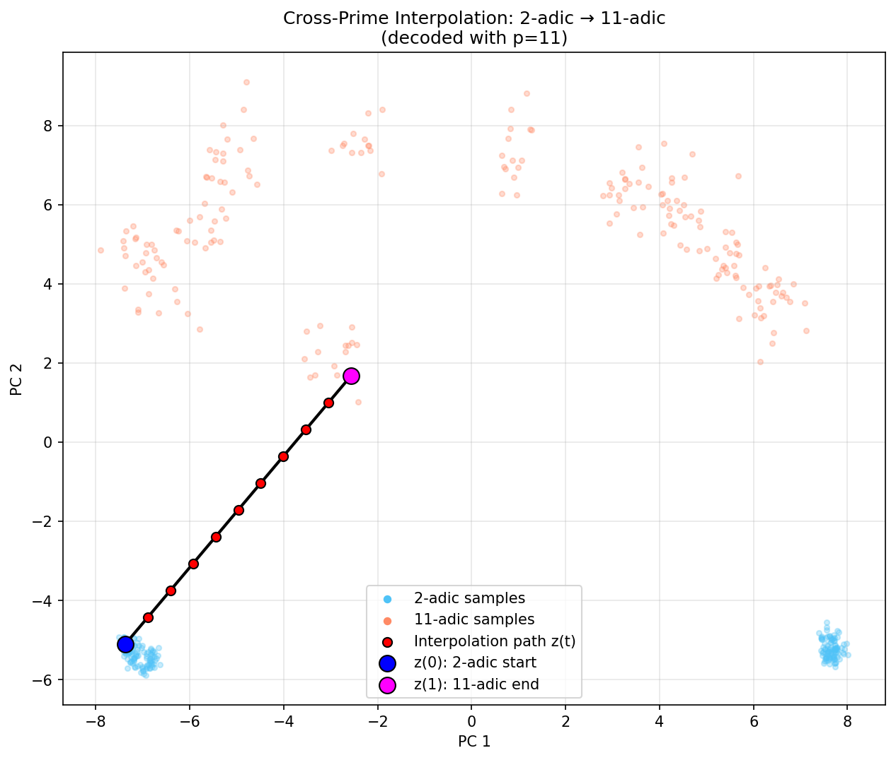 |

#### Within-Prime Interpolation ($p=5$ and $p=7$)

| $p=5$ | $p=7$ |
| :---: | :---: |
| 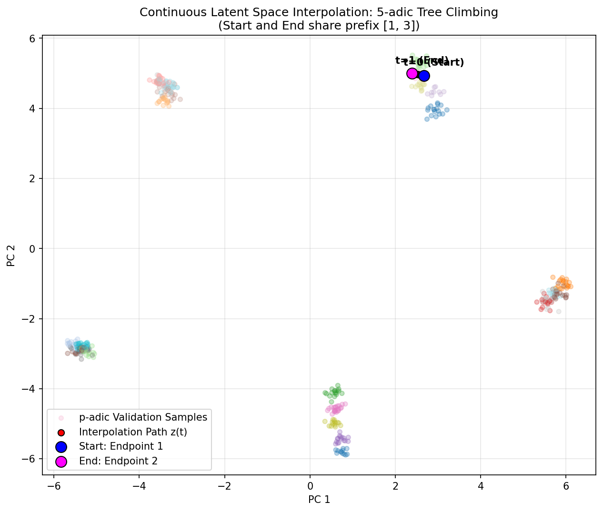 | 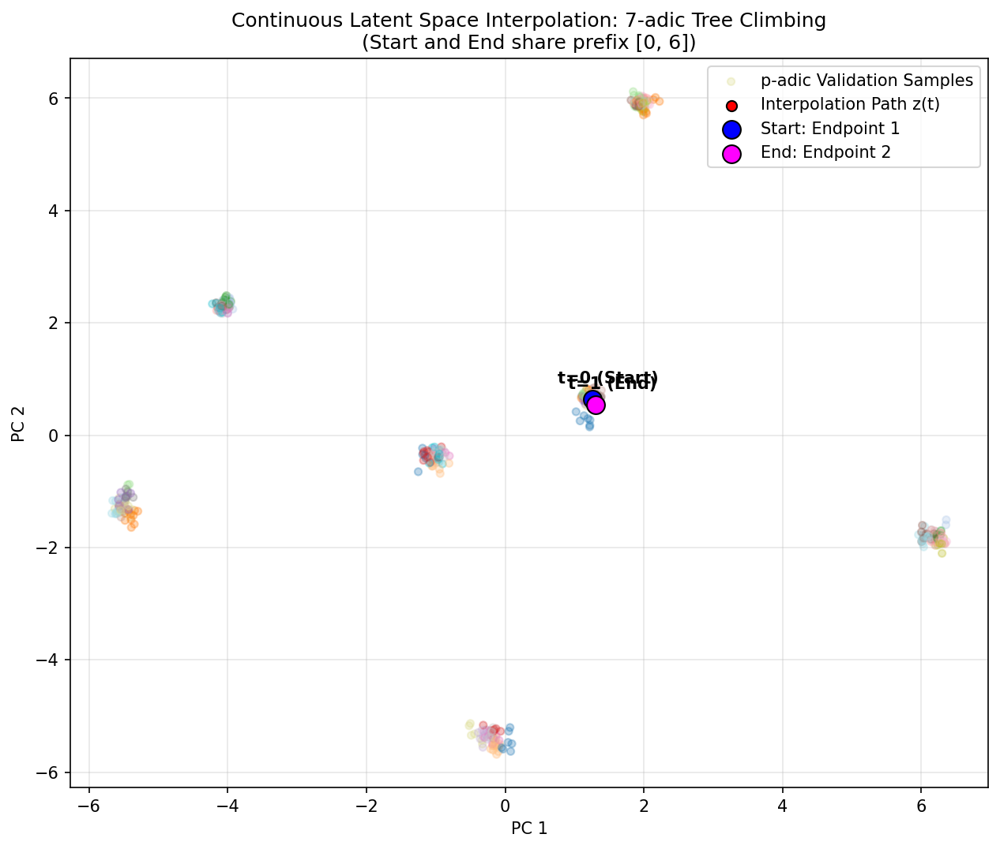 |

---

## The Cascade Gating Inference System

Autoregressive prior sampling (VQ-VAE + Prior) is highly precise but slow due to step-by-step generation. Continuous models (Beta-VAE) are extremely fast (one-step feedforward) but approximate. To leverage the strengths of both, this codebase implements a **Cascade Gating System** (`anomaly_detector.py`):
1. **Fast-Path Generation**: The system samples a candidate sequence from the continuous Beta-VAE.
2. **Self-Reconstruction Gating**: The Beta-VAE reconstructs its own output. If the cross-entropy reconstruction loss is below a calibrated threshold $\tau_p$, the sequence is deemed valid and routed immediately to the user (Fast Path).
3. **Slow-Path Fallback**: If the reconstruction loss exceeds $\tau_p$, the sequence is flagged as anomalous or low-quality. The system falls back to the VQ-VAE + Prior (Slow Path) to generate a precise sequence.

This architecture establishes a Pareto-optimal frontier, allowing users to trade off generation velocity (samples/sec) for reconstruction precision by adjusting $\tau_p$.

---

## Poincaré Disk Hyperbolic Embeddings

A Poincaré disk is a model of 2-dimensional hyperbolic geometry. Trees are discrete analogs of hyperbolic spaces; specifically, a $p$-ary tree can be viewed as a discretization of the hyperbolic plane $\mathbb{H}^2$. 

We map $p$-adic digit sequences $a_0, a_1, \dots, a_{d-1}$ (where $a_i \in \{0, \dots, p-1\}$) to Poincaré coordinates:
* **Hyperbolic Radius**: The depth $d$ of a digit corresponds to the radius $r = \tanh(c \cdot d)$. As $d \rightarrow \infty$, points converge to the boundary circle ($r \rightarrow 1$).
* **Angular Sectors**: The sequence of digits partitions the angular range $[0, 2\pi]$ into $p$-ary sectors. 
* **Ultrametric Isomorphism**: Two numbers are close in $p$-adic distance if they share a long common prefix, meaning their Poincaré paths stay together deep into the disk (closer to the boundary). If they differ early, they must travel back towards the origin to connect, resulting in a large hyperbolic distance.

### Visualizing Tree & Poincaré Embeddings ($p=19$ and $p=23$)

| 19-adic Poincaré Disk | 23-adic Poincaré Disk |
| :---: | :---: |
| 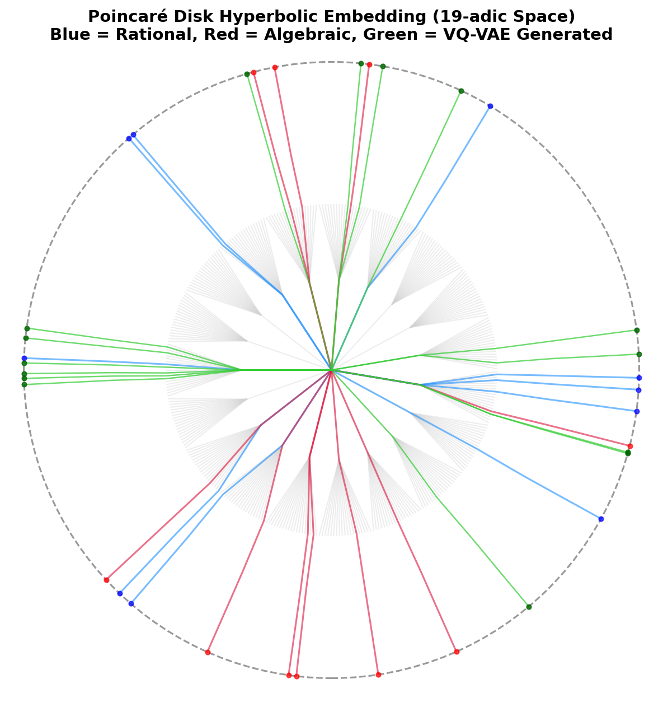 | 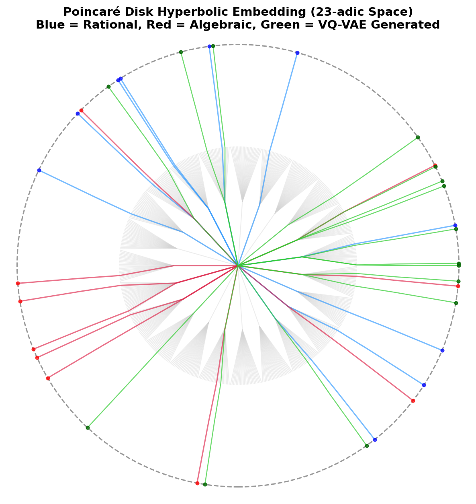 |

| 19-adic Tree Branching | 23-adic Tree Branching |
| :---: | :---: |
| 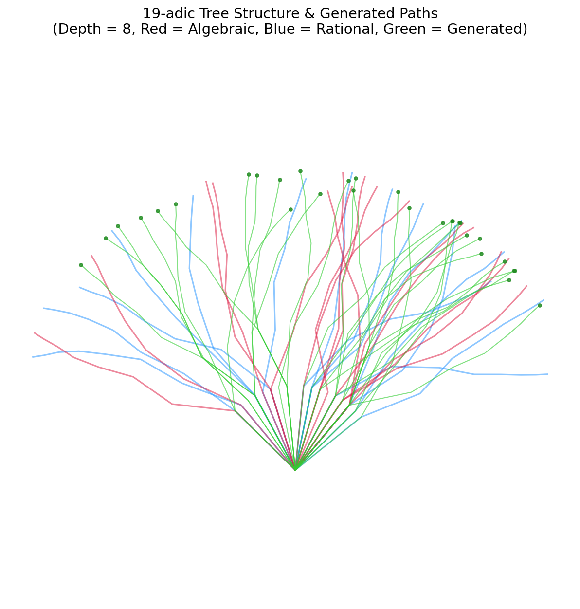 | 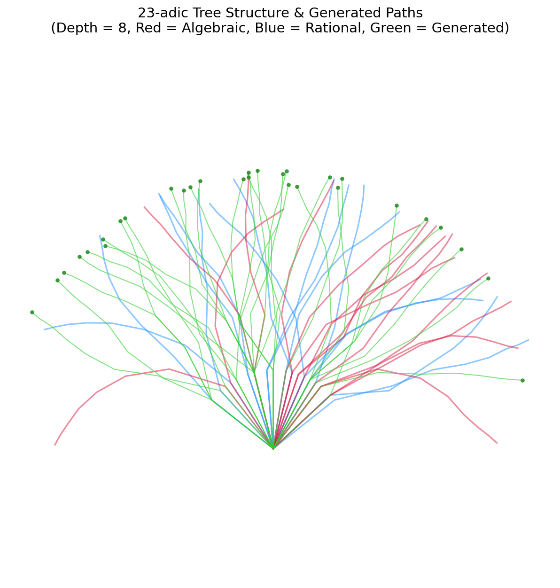 |

*(Blue = Rational sequences, Red = Algebraic sequences, Green = VQ-VAE prior-generated sequences)*

---

## Mathematical Foundations

### 1. The $p$-adic Ultrametric
Unlike real numbers which follow the standard Archimedean metric, $p$-adic numbers are equipped with the **non-Archimedean ultrametric**:
$$d_p(x, y) \le \max\big(d_p(x, z), d_p(z, y)\big)$$
This metric ensures that distance is determined solely by the highest common ancestor (the longest common prefix) in the branching tree.

### 2. Hensel's Lemma & Algebraic Sequences
Our dataset includes algebraic roots (Red trajectories) generated using **Hensel's Lemma**, which acts as the $p$-adic equivalent of Newton's method for finding root approximations:
$$x_{n+1} = x_n - \frac{f(x_n)}{f'(x_0)} \pmod{p^{n+1}}$$
Because Hensel lifting builds roots digit-by-digit, algebraic numbers trace highly structured, non-periodic trajectories down the branching tree, which our VQ-VAE successfully learns to generate.

### 3. Poincaré Ball Reparameterization
The Hyperbolic Beta-VAE encoder maps to a tangent vector $\mu \in T_0\mathbb{B}^d_c$, scaled by $1/\sqrt{d}$ for dimension-independent initialization, then projected to the ball:
$$z_\mu = \exp_0\!\left(\frac{\mu}{\sqrt{d}}\right), \qquad z = \exp_{z_\mu}\!\left(\Pi_{0 \to z_\mu}(v)\right), \quad v \sim \mathcal{N}(0, \sigma^2 I)$$
where $\Pi_{0 \to z_\mu}$ is parallel transport from the origin to $z_\mu$. The decoder receives $\log_0(z) \in \mathbb{R}^d$.

### 4. Lorentz Model
The Lorentz hyperboloid embeds $n$-dimensional hyperbolic space as a sheet of a two-sheeted hyperboloid in $(n+1)$-dimensional Minkowski space. For curvature $k$:
$$\mathbb{H}^n_k = \{x \in \mathbb{R}^{n+1} : -x_0^2 + x_1^2 + \cdots + x_n^2 = -1/k,\ x_0 > 0\}$$
The Lorentz model and the Poincaré ball are isometric (same geometry, different coordinates). The Lorentz form has better numerical properties at high dimension because the metric is a simple Minkowski inner product, without the $\frac{1}{1-\|x\|^2}$ conformal factor that approaches infinity at the Poincaré boundary.

---

## Future Research Directions

* **Curvature Sweep at Convergence**: The current sweep reports are 3-epoch snapshots. Running the full 15-epoch training across $c \in \{0.5, 1.0, 2.0, 5.0\}$ and learnable would reveal whether higher curvature offers a meaningful alignment advantage after convergence, particularly for high-branching primes.
* **Hyperbolic VAE at hd=256**: The Hyperbolic VAE results used `hidden_dim=64`. Retraining at hd=256 (Broad-11, both Poincaré and Lorentz) would give a fair capacity-matched comparison against the Euclidean hd=256 models.
* **Cross-Prime Interpolation Analysis**: Systematic analysis of interpolation paths between prime bases — digit-frequency histograms, p-adic distance distributions, and valid-digit fraction at each interpolation step — would characterise whether the shared latent space encodes a topologically meaningful cross-base structure.
* **Hierarchical Prior**: The current prior is a flat GRU over VQ-VAE tokens. A hierarchical prior (two-level VQ-VAE-2 style, with a top code for branch and a bottom code for local refinement) could better capture the multi-scale structure of $p$-ary trees. Prerequisite: converged capacity experiments above.

---

## How to Run & Reproduce

### 1. Installation
```bash
pip install torch matplotlib numpy geoopt
```

### 2. Run Scaling Experiments
```bash
# Broad-19 with hidden_dim=256 (capacity scaling)
python scaling_analysis/train_broad_p19.py

# Broad-23 training and evaluation
python scaling_analysis/train_broad_p23.py
```

### 3. Prime Embedding A/B Experiment
Trains categorical vs continuous prime embedding side-by-side on the same data split:
```bash
python experiment_prime_embedding.py
```

### 4. Capacity Scaling Experiment
Trains hidden\_dim=64 vs 256 on Broad-19 and compares metrics:
```bash
python experiment_capacity_scaling.py
```

### 5. Train Hyperbolic VAE
Both Poincaré and Lorentz manifolds are supported. Curvature is optionally learnable:
```bash
# Poincaré ball (default)
python train_hyperbolic.py --primes 2 3 5 7 11 --N 64 --curvature 1.0

# Lorentz hyperboloid
python train_hyperbolic.py --primes 2 3 5 7 11 --N 64 --manifold lorentz

# Learnable curvature (works with both manifolds)
python train_hyperbolic.py --primes 2 3 5 7 11 --N 64 --learnable_curvature
```

### 6. Curvature Sweep
Trains 5 curvature configurations on a shared split and saves a Markdown report:
```bash
# Poincaré sweep
python sweep_curvature.py --manifold poincare --epochs 15

# Lorentz sweep
python sweep_curvature.py --manifold lorentz --epochs 15
```
Reports are saved to `./scaling_analysis/curvature_sweep_{poincare,lorentz}.md`.

### 7. Evaluate Cascade Router (supports broad models)
```bash
# On default Broad-11 checkpoint
python evaluate_cascade.py

# On Broad-19 checkpoint (vocab_size=19)
python evaluate_cascade.py \
  --vocab_size 19 \
  --checkpoint_dir ./checkpoints/broad_p19
```

### 8. Latent Space Interpolation
```bash
# Within-prime and cross-prime interpolation
python interpolate.py
```

### 9. Unit Tests
```bash
python test_pipeline.py
```
Covers: modular arithmetic, $p$-adic conversions, Hensel lifting, dataset generation, metric alignment (Euclidean + hyperbolic), VQ-VAE, Prior GRU, Euclidean Beta-VAE, and Hyperbolic VAE (Poincaré and Lorentz, fixed and learnable curvature).

### 10. Generate Poincaré Disk Plots
```bash
python scaling_analysis/poincare_embedding.py
```
